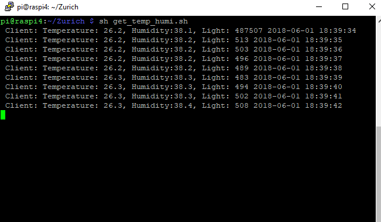

# IoT - Pre-emptive Mold & Fungus Damage Loss

## Objective
Aim is to provide a solution to avoid home damges due to climate changes, using IoT technology pre-empty the situation and keep healthy life/building strengthen as well avoid insurance claims.
## Goal:
* Mold is a common type of fungus that thrives in moist, warm conditions. 
* The spores they release causes illness to humans.
* Buildings get damaged due to fungus
* The growth of mold claims has been exponential in the past years
* Sizable mold claims are pending in the United States, particularly in Florida, California, Texas, and Arizona. 
 - Results into insurance claim as well as health issue. 

## Features:
* Using IoT/sensing technology, data (moisture, humidity, temperature, Light Sensitive, etc.) will be collected, transmitted, stored, processed and visualized. 
* “Anomaly detection” machine learning algorithm will be used to decide whether indoor situations are favorable for mold/fungi.
* Meaningful information gets shared with users on their mobile APP/ email inbox. The information will be used to pre-notify the users to take preventive measures to avoid any potential future loss. 

## Architecture

## Docs:

## Developer Segment
### Minimum Required Hardware's:
1. Raspberry Pi 3
2. Temperature/Moisture Sensor [DHT11 Sensor](https://www.amazon.in/REES52-Digital-Temperature-Humidity-Compatible/dp/B01MXRT9DZ/ref=sr_1_1?ie=UTF8&qid=1526983758&sr=8-1&keywords=dht11+temperature+and+humidity+sensor)
3. Photosensitive Sensor [example](https://www.amazon.in/SunRobotics-Sensor-Module-Photosensitive-Arduino/dp/B0738R8HKP/ref=sr_1_2?ie=UTF8&qid=1526983713&sr=8-2&keywords=photosensitive+sensor)
4. Arduino Board

### Wiring Connections
#### Sensor   to   Raspberry Pi
1. VCC to 5V
2. GND to GND
3. Serial data to GPIO4
##### Sensor   to   Arduino
1. VCC to 5V
2. GND to GND
3. Serial data to A0

### Installation steps:
clone git repo at https://github.com/rgkrishnas/IoT-PreemptMold-FungsDamageLoss/archive/master.zip

### Hardware Chip config & migration
1. Copy the below files into Raspberry pi 

#### Scripts:
1. get_temp_humi.sh
2. get_temp_humi.py
3. iot_preempt_settings.py
4. run_analytical.sh
5. AnalyzeTemperature.py

### Third party libraries/SDK's needs to be installed:
1. Update the pi with latest libraries
* sudo apt-get update
* sudo apt-get install build-essential python-dev
2. Install Adafruit_Python_DHT
* wget https://github.com/adafruit/Adafruit_Python_DHT/archive/master.zip
* unzip master.zip
* cd Adafruit_Python_DHT
* sudo python setup.py install
3. Install python simplejson libraries
  >sudo pip install simplejson
4. Install python MQTT Client
 >sudo pip install paho-mqtt

### How to run the programs

1. Open a pi Linux shell window and the run the below command
   >sh get_temp_humi.sh
   
2. For analytical & notification open another shell window and run the below command
   >sh run_analytical.sh
   
#### IBM Watson Configuration (optional Only for GUI display)
   Create a Watson IoT service in IBM --> Go to NodeRed and import the file NodeRed_Script.txt access the URL
   e.g. https://[appservice_name].mybluemix.net/mold
  1. Dashboard View
   
   
   
### Demo Video 

### Any Technical Queries:
   Gopal (grajaram@dxc.com) 
